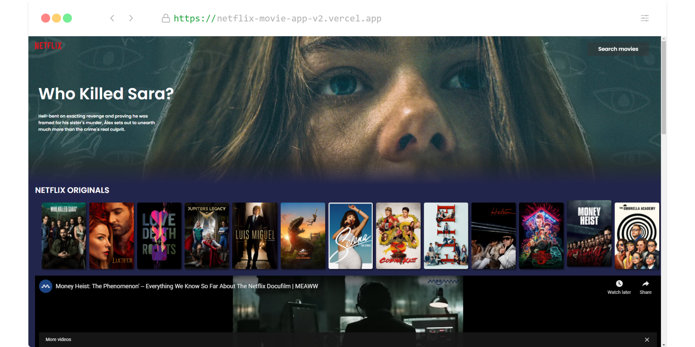
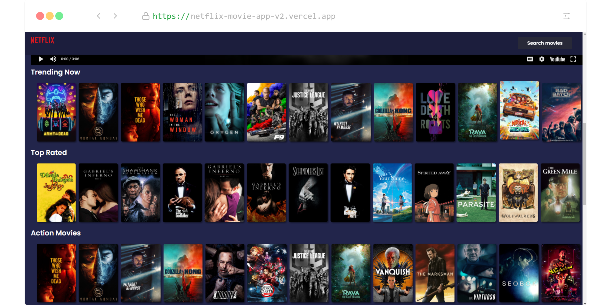
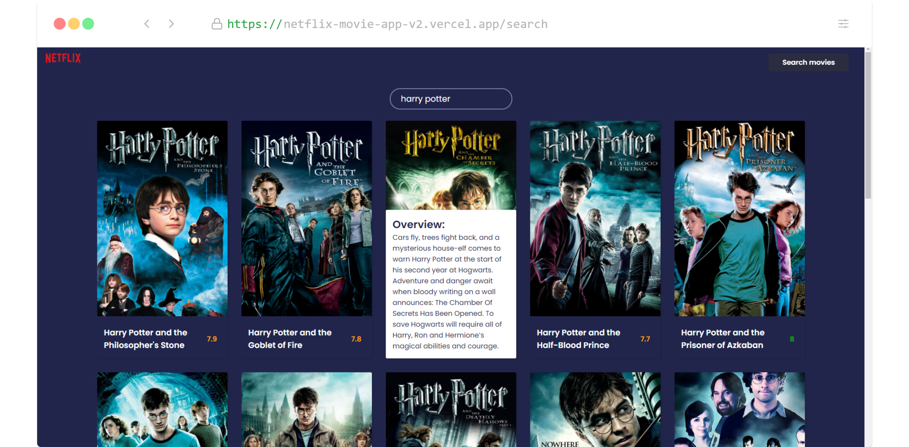

<div>

# Netflix ui Clone App with movies search Using TMDB api

<a href="https://netflix-movie-app-v2.vercel.app/"
 alt="Try the Demo on Vercel!">



</a>

> Before you continue, try the demo: https://netflix-movie-app-v2.vercel.app/ <br />

<hr />

## Features?

- UI is similar to netflix.
- You can click on netflix originals to see their trailers.
- You can search movies across tmdb database.
  <br />

## _How?_

Start by cloning this repository to your `localhost`
so that you can follow the example/tutorial offline:

```sh
git clone https://github.com/Apoorvssj/TodoApp.git
```

Install the `devDependencies` so you can run the tests:

```sh
 npm install
```

Now you have _everything_ you need to start this Todo List !

```sh
 npm start
```
